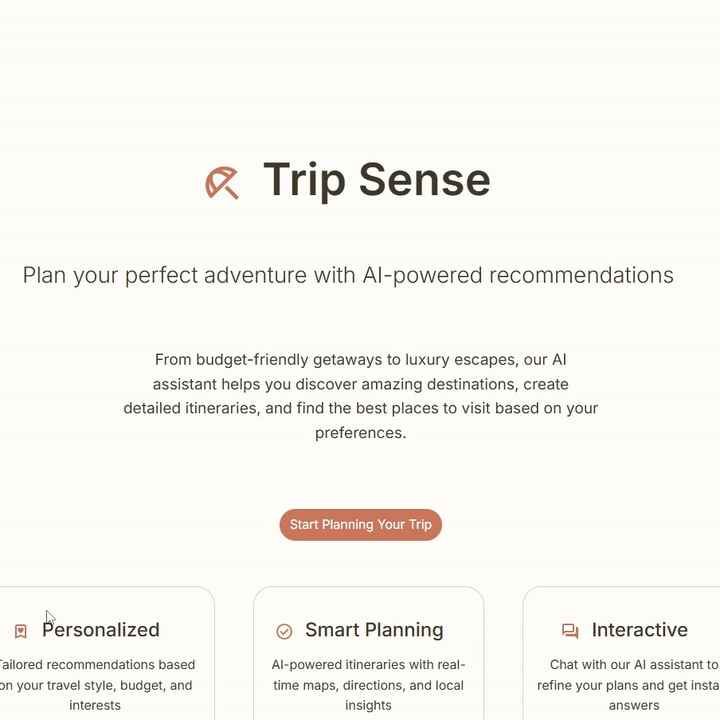
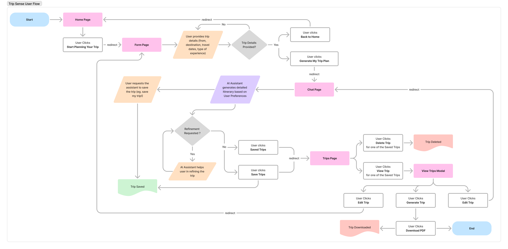
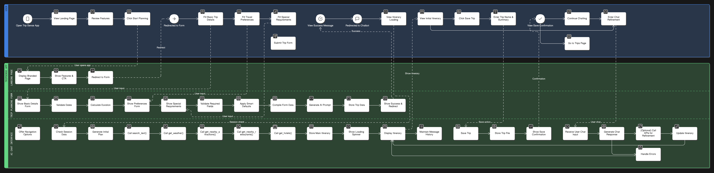
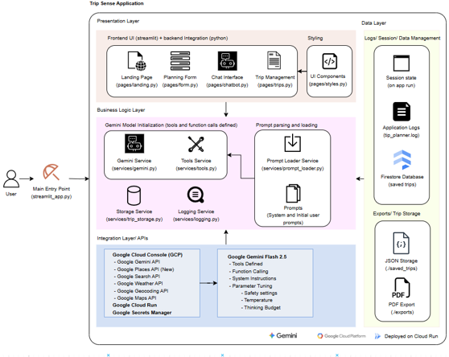

# Trip Sense

An intelligent, end-to-end travel planning application powered by Google's Gemini AI that creates personalized itineraries using real-time data. Features include AI-powered planning, cloud storage with Firebase, real-time booking via SerpAPI, integrated payment processing, and professional PDF exports. Built with Streamlit for a modern, seamless user experience from planning to booking.



[Try the App !](https://trip-sense-988549865021.europe-north1.run.app/)

## Table of Contents

- [Features](#features)
  - [AI-Powered Planning](#ai-powered-planning)
  - [Travel Personalization](#travel-personalization)
  - [Authentication & Security](#authentication--security)
  - [Cloud Storage & Sync](#cloud-storage--sync)
  - [Real-time Booking](#real-time-booking)
  - [Payment & Transactions](#payment--transactions)
  - [Export & Sharing](#export--sharing)
- [Quick Start](#quick-start)
  - [Prerequisites](#prerequisites)
  - [Installation](#installation)
- [Architecture](#architecture)
  - [Project Structure](#project-structure)
- [Application Workflow](#application-workflow)
  - [User Journey](#user-journey)
  - [Data Flow](#data-flow)
  - [User Flow Diagram](#user-flow-diagram)
  - [Application Flow Diagram](#application-flow-diagram)
  - [Architecture Diagram](#architecture-diagram)
- [Technology Stack](#technology-stack)
  - [Core Technologies](#core-technologies)
  - [Key Dependencies](#key-dependencies)
- [Configuration](#configuration)
  - [Environment Variables](#environment-variables)
  - [Model Configuration](#model-configuration)
  - [Key Components](#key-components)
- [Troubleshooting](#troubleshooting)
  - [Common Issues](#common-issues)
  - [Debug Mode](#debug-mode)
- [Security Considerations](#security-considerations)
  - [API Key Security](#api-key-security)
  - [User Data Protection](#user-data-protection)
  - [Payment Security](#payment-security)
  - [Firebase Security](#firebase-security)
  - [Best Practices](#best-practices)
- [What Makes Trip Sense Different?](#what-makes-trip-sense-different)
  - [Complete End-to-End Solution](#complete-end-to-end-solution)
  - [Real-Time Intelligence](#real-time-intelligence)
  - [Zero Manual Research](#zero-manual-research)
  - [Cloud-First Architecture](#cloud-first-architecture)
- [Additional Resources](#additional-resources)
  - [Setup Guides](#setup-guides)
  - [Documentation](#documentation)
- [Contributing](#contributing)
  - [Development Setup](#development-setup)
  - [Code Style](#code-style)
- [License](#license)

## Features

### AI-Powered Planning
- Smart Itinerary Generation: Creates detailed day-by-day travel plans
- Real-time Data Integration: Uses Google Places, Maps, Weather APIs, and SerpAPI
- Personalized Recommendations: Tailored to your travel style and preferences
- Interactive Chat Interface: Refine and customize your itinerary through conversation
- Function Calling: Automatic integration with Google APIs for real-time data

### Travel Personalization
- Travel Styles: Adventure, Culture, Relaxation, Food, Nightlife, Family, Photography, Shopping, Nature, Mixed
- Budget Levels: Low, Medium, High with appropriate recommendations
- Special Requests: Vegetarian options, accessibility features, specific attractions
- Group Planning: Solo, couple, family, or group travel optimization
- Multi-traveler Support: Collect and manage information for all travelers in your group

### Authentication & Security
- Secure Firebase Authentication: Email/password authentication with verification
- Password Reset: Easy password recovery functionality
- Session Management: Persistent user sessions across devices
- Email Verification: Required email verification for account security
- OAuth Ready: Infrastructure ready for Google Sign-In integration

### Cloud Storage & Sync
- Firebase Firestore Integration: Cloud-based trip persistence
- Cross-Device Access: Access your trips from any device, anywhere
- Real-time Sync: Automatic synchronization across all your devices
- Data Security: Secure cloud storage with Firebase security rules
- Trip History: Never lose your travel plans

### Real-time Booking
- Live Flight Search: Real-time flight prices, airlines, and schedules via SerpAPI
- Hotel Availability: Current hotel prices, ratings, and amenities
- Cost Estimation: Automatic budget calculations by category
- Multi-traveler Booking: Manage bookings for entire travel groups
- Booking Consolidation: All travel arrangements in one place

### Payment & Transactions
- Integrated Payment Gateway: Complete booking payments within the app
- Transaction Tracking: Monitor all your booking transactions
- Cost Breakdown: Detailed estimates by flights, hotels, activities, transport
- Group Cost Management: Automatic calculations for multiple travelers
- Secure Processing: Safe and secure payment handling

### Export & Sharing
- Professional PDF Export: Generate beautifully formatted trip documents
- Clickable Links: Embedded booking links in PDF exports
- Comprehensive Details: Full itinerary with weather, times, and recommendations
- Easy Sharing: Share trip plans with travel companions
- Offline Access: Download and access trips without internet

## Quick Start

### Prerequisites
- Python 3.8+
- Google Cloud Platform account
- Google Gemini AI API key
- Google Maps Platform API key
- Firebase account (for authentication and cloud storage)
- SerpAPI account (optional - for real-time booking features)

### Installation

1. **Clone the repository**
   ```bash
   git clone <repository-url>
   cd ai-trip-planner-h2s
   ```

2. **Create virtual environment**
   ```bash
   python -m venv venv
   
   # On Windows:
   venv\Scripts\activate
   
   # On macOS/Linux:
   source venv/bin/activate
   ```

3. **Install dependencies**
   ```bash
   pip install -r requirements.txt
   ```

4. **Set up environment variables**
   
   **For Local Development:**
   Create a `.env` file in the root directory:
   ```env
   GEMINI_API_KEY=your_gemini_api_key_here
   GOOGLE_MAPS_API_KEY=your_google_maps_api_key_here
   SERPAPI_API_KEY=your_serpapi_api_key_here
   ```
   
   **Firebase Configuration:**
   Create `.streamlit/firebase_config.json`:
   ```json
   {
     "apiKey": "YOUR_API_KEY",
     "authDomain": "your-project.firebaseapp.com",
     "projectId": "your-project-id",
     "storageBucket": "your-project.appspot.com",
     "messagingSenderId": "YOUR_SENDER_ID",
     "appId": "YOUR_APP_ID"
   }
   ```
   
   **For Streamlit Cloud Deployment:**
   Add these as secrets in your Streamlit Cloud dashboard:
   - Go to your app settings → Secrets
   - Add the same variables in TOML format:
   ```toml
   GEMINI_API_KEY = "your_gemini_api_key_here"
   GOOGLE_MAPS_API_KEY = "your_google_maps_api_key_here"
   SERPAPI_API_KEY = "your_serpapi_api_key_here"
   FIREBASE_CREDENTIALS = '{"type": "service_account", ...}'
   FIREBASE_WEB_CONFIG = '{"apiKey": "...", ...}'
   ```
   
   **Get Your API Keys:**
   - **Gemini API Key**: [Google AI Studio](https://aistudio.google.com/app/apikey)
   - **Google Maps API Key**: [Google Cloud Console](https://console.cloud.google.com/apis/credentials)
   - **SerpAPI Key**: [SerpAPI.com](https://serpapi.com/)
   - **Firebase Setup**: See [setup_guides/FIREBASE_SETUP.md](setup_guides/FIREBASE_SETUP.md) and [setup_guides/FIREBASE_AUTH_SETUP.md](setup_guides/FIREBASE_AUTH_SETUP.md)

5. **Enable Google APIs**
   In your Google Cloud Console, enable:
   - Places API (New)
   - Weather API
   - Maps JavaScript API

6. **Set up Firebase** (Required for authentication and cloud storage)
   
   Follow detailed guides:
   - [Firebase Firestore Setup](setup_guides/FIREBASE_SETUP.md) - For cloud storage
   - [Firebase Authentication Setup](setup_guides/FIREBASE_AUTH_SETUP.md) - For user authentication
   
   Quick steps:
   - Create Firebase project
   - Enable Firestore Database
   - Enable Authentication (Email/Password)
   - Download service account key → save as `firebase-key.json`
   - Create `.streamlit/firebase_config.json` with web config

7. **Set up SerpAPI** (Optional - for real-time booking)
   
   - Sign up at [SerpAPI.com](https://serpapi.com/)
   - Get your API key (free tier available)
   - Add to `.env`: `SERPAPI_API_KEY=your_key_here`
   - See [setup_guides/SERPAPI_SETUP.md](setup_guides/SERPAPI_SETUP.md) for details

8. **Run the application**
   ```bash
   streamlit run streamlit_app.py
   ```
   
   The app will be available at `http://localhost:8501`

## Architecture

### Project Structure
```
trip-sense-h2s/
├── .devcontainer/            # Dev Container configuration
├── .streamlit                # Streamlit configs
│   └── config.toml              # Config file
├── exports/                  # Generated PDF exports
│   ├── Trip-to-Bangaladesh*.pdf
│   └── A-Whirlwind-Day-in-the-Big-Apple*.pdf
├── documents/                 # Project documentation and diagrams
│   ├── landing-gif.gif            # Landing gif
│   ├── TripSenseUserFlow.png      # User flow diagram
│   ├── TripSenseArchitecture.png  # Architecture diagram
│   ├── TripSenseAppFlow.png       # Application flow diagram
│   └── GenAI Exchange Hackathon_Prototypye_Submission_Team_TripSense.pdf
├── pages/                    # Streamlit pages
│   ├── landing.py               # Landing page with feature overview
│   ├── form.py                  # Trip planning form
│   ├── chatbot.py               # AI chat interface
│   ├── trips.py                 # Saved trips management and PDF export
│   └── book.py                  # Real-time booking and payment flow
├── prompts/                  # AI prompts and templates
│   ├── user/                    # User prompt templates
│   │   └── initial_prompt.jinja
│   └── system.yaml              # System instructions for AI
├── saved_trips/               # Session-based trip storage (JSON files)
│   ├── default_c1e8ef8d.json   # Example saved trip
│   └── default_08cceddd.json   # Example saved trip
├── services/                 # Core business logic
│   ├── __init__.py              # Package initialization│   
│   ├── airport_codes.py         # Airport code resolution
│   ├── export.py                # PDF export functionality with clickable links
│   ├── firebase_auth.py         # Firebase Authentication service
│   ├── firebase_service.py      # Firebase Firestore integration
│   ├── gemini.py                # Gemini AI integration with function calling
│   ├── logging.py               # Logging and metrics tracking
│   ├── prompt_loader.py         # Jinja2 template management
│   ├── serpapi_service.py       # SerpAPI integration for flights/hotels
│   ├── tools.py                 # Google API functions (Places, Weather, Maps)
│   └── trip_storage.py          # Cloud-based trip storage with Firebase
├── styles/                    # UI styling and themes
│   └── styles.py                # Streamlit custom styles
├── tests/                     # Unit Tests
│   └── styles.py                # Testing trip storage functions
├── Dockerfile                 # Docker containerization config
├── LICENSE                    # Project license
├── README.md                  # Project documentation
├── requirements.txt           # Python dependencies
└── streamlit_app.py           # Main application entry point
```

## Application Workflow

### User Journey
1. **Authentication**: Secure sign-in/sign-up with Firebase Authentication
2. **Landing Page**: Welcome screen with feature overview
3. **Trip Planning Form**: Input destination, dates, preferences, and budget
4. **AI Processing**: Gemini AI generates personalized itinerary using real-time data
5. **Interactive Chat**: Refine and customize the itinerary through conversation
6. **Cloud Storage**: Save trips to Firebase Firestore with cross-device sync
7. **Trip Management**: View, edit, and manage multiple trips from any device
8. **Real-time Booking**: Search live flights and hotels with current pricing
9. **Payment Processing**: Complete booking with integrated payment gateway
10. **PDF Export**: Generate professional PDF with clickable booking links

### Data Flow
1. **User Authentication**: Firebase Auth validates user credentials
2. **User Input**: Form data collected and validated
3. **Prompt Generation**: Dynamic prompts created using Jinja2 templates
4. **AI Processing**: Gemini AI processes request with function calling
5. **API Integration**: Real-time data fetched from Google APIs and SerpAPI
6. **Response Rendering**: Markdown-formatted itinerary displayed
7. **Cloud Storage**: Trip data saved to Firebase Firestore
8. **Booking Integration**: Live flight/hotel data from SerpAPI
9. **Payment Processing**: Secure transaction handling and confirmation
10. **Export Generation**: Professional PDF with embedded links

### User Flow Diagram



*The above diagram illustrates the complete user journey from initial trip planning to final itinerary export.*

### Application Flow Diagram



*The above diagram illustrates the application flow from initial trip planning to final itinerary export.*

### Architecture Diagram



*The above diagram illustrates the architecture and used technologies*

## Technology Stack

### Core Technologies
- **Python 3.8+**: Main programming language
- **Streamlit 1.49+**: Web application framework
- **Google Gemini AI**: Advanced language model with function calling
- **Google Maps Platform**: Location services and weather data
- **Firebase**: Authentication and Firestore database for cloud storage
- **SerpAPI**: Real-time flight and hotel search integration
- **Jinja2**: Template engine for dynamic prompts
- **PyYAML**: Configuration file management
- **ReportLab**: Professional PDF generation

### Key Dependencies
- `google-genai`: Google Gemini AI integration
- `streamlit`: Web app framework
- `firebase-admin`: Firebase Admin SDK for Firestore
- `google-search-results`: SerpAPI Python client
- `python-dotenv`: Environment variable management
- `jinja2`: Template rendering
- `pyyaml`: YAML configuration parsing
- `reportlab`: PDF generation for exports
- `requests`: HTTP client for API calls
- `Pyrebase4`: Firebase Authentication for web apps

## Configuration

### Environment Variables
| Variable | Description | Required |
|----------|-------------|----------|
| `GEMINI_API_KEY` | Google Gemini AI API key | Yes |
| `GOOGLE_MAPS_API_KEY` | Google Maps Platform API key | Yes |
| `SERPAPI_API_KEY` | SerpAPI key for flight/hotel search | Yes |
| `FIREBASE_CREDENTIALS` | Firebase service account JSON | Yes |
| `FIREBASE_WEB_CONFIG` | Firebase web app configuration JSON | Yes |

### Model Configuration
The application is configured to use:
- **Model**: gemini-2.5-flash-lite
- **Temperature**: 0.2 For responses to be Factual and consistent
- **Max Output Tokens**: 2048 for comprehensive responses
- **Top P**: 0.8  Nucleus sampling for controlled creativity
- **Thinking**: 0 Disabled cost concerns/ Can enable for better responses
- **Safety Settings**: Configured to block harmful content
- **Function Calling**: Enabled for real-time data integration

### Key Components

#### AI Engine (services/gemini.py)
- TripSenseAI Class: Main AI orchestration
- Function Calling: Automatic tool execution
- Response Processing: Handles multi-part responses
- Context Management: Optimized conversation handling
- Caching: Efficient client initialization

#### Tool Integration (services/tools.py)
- search_text: Location resolution and coordinates
- get_nearby_attractions: Tourist attractions and sights
- get_nearby_restaurants: Dining recommendations
- get_hotels: Accommodation options
- get_weather: Weather forecasts
- save_trip: Trip persistence

#### Authentication (services/firebase_auth.py)
- Firebase Authentication: Email/password sign-in and sign-up
- Session Management: Persistent user sessions
- Password Reset: Email-based password recovery
- Email Verification: Account verification workflow
- User Management: Profile and session handling

#### Cloud Storage (services/firebase_service.py & services/trip_storage.py)
- Firebase Firestore: Cloud-based trip persistence
- CRUD Operations: Create, read, update, delete trips
- Cross-Device Sync: Real-time synchronization
- Data Validation: Ensures data integrity
- User Isolation: Secure per-user data storage

#### Booking Integration (services/serpapi_service.py)
- Real-time Flight Search: Live flight prices and availability
- Hotel Search: Current hotel rates and amenities
- Demo Mode: Fallback when API quota exceeded
- Cost Estimation: Automatic budget calculations
- Multi-traveler Support: Group booking handling

#### Export System (services/export.py)
- PDF Generation: Professional document creation
- Clickable Links: Embedded booking URLs
- Markdown Parsing: Rich text formatting
- Table Generation: Structured trip details
- Custom Styling: Branded PDF layouts

#### Pages & UI
- Landing Page (pages/landing.py): Feature showcase and authentication
- Planning Form (pages/form.py): Trip input and validation
- Chat Interface (pages/chatbot.py): AI-powered itinerary refinement
- Trip Management (pages/trips.py): Cloud-stored trip viewing and PDF export
- Booking System (pages/book.py): Real-time booking and payment flow

## Troubleshooting

### Common Issues

#### API Key Issues
```bash
Error: GOOGLE_MAPS_API_KEY not set
```
**Solution**: Ensure `.env` file contains valid API keys

#### Places API Disabled
```bash
Google Places API is not enabled
```
**Solution**: Enable Places API (New) in Google Cloud Console

#### Weather API Errors
```bash
Weather API error: 404 Not Found
```
**Solution**: Ensure Weather API is enabled and API key has proper permissions

#### Firebase Authentication Errors
```bash
Invalid API key
```
**Solution**: Verify `firebase_config.json` has correct credentials. See [setup_guides/FIREBASE_AUTH_SETUP.md](setup_guides/FIREBASE_AUTH_SETUP.md)

```bash
Email already registered
```
**Solution**: User already has an account. Use sign-in or password reset

#### Firebase Firestore Errors
```bash
Permission denied
```
**Solution**: Check Firebase security rules and ensure Firestore is enabled. See [setup_guides/FIREBASE_SETUP.md](setup_guides/FIREBASE_SETUP.md)

#### SerpAPI Issues
```bash
SerpAPI quota exceeded
```
**Solution**: App automatically falls back to demo mode. Upgrade SerpAPI plan or wait for quota reset

### Debug Mode
Enable debug logging by setting log level in `services/logging.py`:
```python
logger.setLevel(logging.DEBUG)
```

### Viewing Logs
Check application logs for detailed error information:
```bash
tail -f trip_planner.log
```

## Security Considerations

### API Key Security
- **Environment Variables**: Never commit API keys to version control
- **Key Restrictions**: Restrict API keys to specific APIs and domains
- **Regular Rotation**: Rotate API keys periodically
- **Firebase Config**: Never commit `firebase_config.json` or `firebase-key.json`

### User Data Protection
- **Firebase Authentication**: Passwords hashed and secured by Firebase
- **Email Verification**: Required for account activation
- **Session Security**: Secure token-based authentication
- **Data Isolation**: User trips stored with user-specific access controls

### Payment Security
- **Secure Processing**: Payment information handled securely
- **Transaction Tracking**: All transactions logged and traceable
- **PCI Compliance**: Follow PCI-DSS guidelines for payment handling
- **HTTPS Only**: All communications encrypted in transit

### Firebase Security
- **Security Rules**: Configure Firestore security rules properly
- **Service Account**: Protect Firebase service account JSON files
- **Access Control**: User-based read/write permissions
- **Audit Logging**: Monitor Firebase access logs

### Best Practices
1. Use environment variables for all secrets
2. Enable Firebase security rules
3. Restrict API keys by domain/IP
4. Enable email verification
5. Monitor authentication logs
6. Regular security audits
7. Keep dependencies updated
8. Use HTTPS in production

## Contributing

### Development Setup
1. Fork the repository
2. Create a feature branch
3. Make your changes
4. Add tests if applicable
5. Submit a pull request

### Code Style
- Python: Follow PEP 8 guidelines
- Documentation: Comprehensive docstrings
- Type Hints: Use type annotations
- Error Handling: Explicit exception handling

## What Makes Trip Sense Different?

### Complete End-to-End Solution
Unlike traditional trip planners that require switching between multiple apps and websites, Trip Sense provides everything in one place:
- **Plan** → AI-powered itinerary generation
- **Refine** → Conversational customization
- **Save** → Cloud storage with cross-device sync
- **Book** → Real-time flight and hotel search
- **Pay** → Integrated payment processing
- **Export** → Professional PDF with clickable links

### Real-Time Intelligence
- Live data from Google Maps, Places, Weather APIs
- Current flight prices and hotel availability via SerpAPI
- AI-powered recommendations based on real-time conditions
- No stale data or outdated information

### Zero Manual Research
- AI handles all location discovery and validation
- Automatic weather integration for each destination
- Smart recommendations based on preferences
- No need to manually search dozens of websites

### Cloud-First Architecture
- Access your trips from any device
- Never lose your travel plans
- Secure authentication and data storage
- Real-time synchronization across devices

## Additional Resources

### Setup Guides
- 📘 [Firebase Setup Guide](setup_guides/FIREBASE_SETUP.md) - Configure Firestore database
- 🔐 [Firebase Authentication Setup](setup_guides/FIREBASE_AUTH_SETUP.md) - Enable user authentication
- ✈️ [SerpAPI Setup Guide](setup_guides/SERPAPI_SETUP.md) - Configure booking integration
- 🚀 [Deployment Guide](setup_guides/DEPLOYMENT_GUIDE.md) - Deploy to production

### Documentation
- Full API documentation in code docstrings
- System prompts in `prompts/system.yaml`
- Example trips in `saved_trips/` directory

## License

This project is licensed under the MIT License - see the LICENSE file for details.

---

**Built with Google Gemini AI, Firebase, and Streamlit**

*Creating the future of intelligent travel planning*

*Last updated: November 2025*
