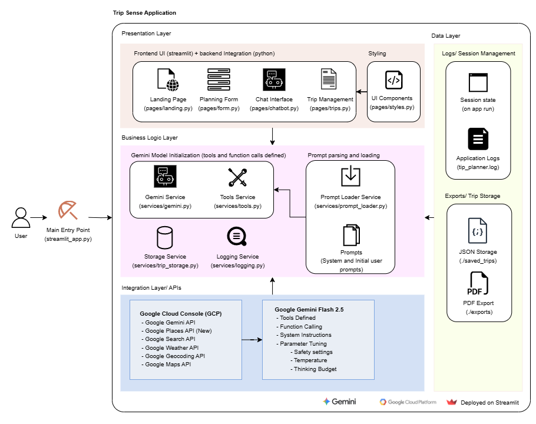

# Trip Sense

An intelligent travel planning application powered by Google's Gemini AI that creates personalized itineraries using real-time data from Google Maps, Places, and Weather APIs. Built with Streamlit for a modern, interactive web interface.


[https://trip-sense.streamlit.app/](https://trip-sense-988549865021.europe-north1.run.app/)

## Table of Contents

- [Features](#features)
  - [AI-Powered Planning](#ai-powered-planning)
  - [Travel Personalization](#travel-personalization)
  - [Smart Features](#smart-features)
- [Quick Start](#quick-start)
  - [Prerequisites](#prerequisites)
  - [Installation](#installation)
- [Architecture](#architecture)
  - [Project Structure](#project-structure)
- [Application Workflow](#application-workflow)
  - [User Journey](#user-journey)
  - [Data Flow](#data-flow)
  - [User Flow Diagram](#user-flow-diagram)
  - [Application Flow Diagram](#application-flow-diagram)
  - [Architecture Diagram](#architecture-diagram)
- [Technology Stack](#technology-stack)
  - [Core Technologies](#core-technologies)
  - [Key Dependencies](#key-dependencies)
- [Configuration](#configuration)
  - [Environment Variables](#environment-variables)
  - [Model Configuration](#model-configuration)
  - [Key Components](#key-components)
- [Troubleshooting](#troubleshooting)
  - [Common Issues](#common-issues)
  - [Debug Mode](#debug-mode)
- [Security Considerations](#security-considerations)
  - [API Key Security](#api-key-security)
- [Contributing](#contributing)
  - [Development Setup](#development-setup)
  - [Code Style](#code-style)
- [License](#license)

## Features

### AI-Powered Planning
- Smart Itinerary Generation: Creates detailed day-by-day travel plans
- Real-time Data Integration: Uses Google Places, Maps, and Weather APIs
- Personalized Recommendations: Tailored to your travel style and preferences
- Interactive Chat Interface: Refine and customize your itinerary through conversation

### Travel Personalization
- Travel Styles: Adventure, Culture, Relaxation, Food, Nightlife, Family, Photography, Shopping, Nature, Mixed
- Budget Levels: Low, Medium, High with appropriate recommendations
- Special Requests: Vegetarian options, accessibility features, specific attractions
- Group Planning: Solo, couple, family, or group travel optimization

### Smart Features
- Function Calling: Automatic integration with Google APIs for real-time data
- Trip Storage: Save and manage multiple trip plans
- PDF Export: Export trips to PDF format
- Session Management: Efficient state handling and caching
- Error Handling: Robust error recovery and user feedback

## Quick Start

### Prerequisites
- Python 3.8+
- Google Cloud Platform account
- API keys for Google Maps Platform and Gemini AI

### Installation

1. **Clone the repository**
   ```bash
   git clone <repository-url>
   cd ai-trip-planner-h2s
   ```

2. **Create virtual environment**
   ```bash
   python -m venv venv
   
   # On Windows:
   venv\Scripts\activate
   
   # On macOS/Linux:
   source venv/bin/activate
   ```

3. **Install dependencies**
   ```bash
   pip install -r requirements.txt
   ```

4. **Set up environment variables**
   
   **For Local Development:**
   Create a `.env` file in the root directory:
   ```env
   GEMINI_API_KEY=your_gemini_api_key_here
   GOOGLE_MAPS_API_KEY=your_google_maps_api_key_here
   ```
   
   **For Streamlit Cloud Deployment:**
   Add these as secrets in your Streamlit Cloud dashboard:
   - Go to your app settings → Secrets
   - Add the same variables in TOML format:
   ```toml
   GEMINI_API_KEY = "your_gemini_api_key_here"
   GOOGLE_MAPS_API_KEY = "your_google_maps_api_key_here"
   ```
   
   **Get Your API Keys:**
   - **Gemini API Key**: [Google AI Studio](https://aistudio.google.com/app/apikey)
   - **Google Maps API Key**: [Google Cloud Console](https://console.cloud.google.com/apis/credentials)

5. **Enable Google APIs**
   In your Google Cloud Console, enable:
   - Places API (New)
   - Weather API
   - Maps JavaScript API

6. **Run the application**
   ```bash
   streamlit run streamlit_app.py
   ```

## Architecture

### Project Structure
```
trip-sense-h2s/
├── .devcontainer/            # Dev Container configuration
├── .streamlit                # Streamlit configs
│   └── config.toml              # Config file
├── exports/                  # Generated PDF exports
│   ├── Trip-to-Bangaladesh*.pdf
│   └── A-Whirlwind-Day-in-the-Big-Apple*.pdf
├── documents/                 # Project documentation and diagrams
│   ├── landing-gif.gif            # Landing gif
│   ├── TripSenseUserFlow.png      # User flow diagram
│   ├── TripSenseArchitecture.png  # Architecture diagram
│   ├── TripSenseAppFlow.png       # Application flow diagram
│   └── GenAI Exchange Hackathon_Prototypye_Submission_Team_TripSense.pdf
├── pages/                    # Streamlit pages
│   ├── trips.py                 # Saved trips management
│   ├── landing.py               # Landing page with feature overview
│   ├── form.py                  # Trip planning form
│   └── chatbot.py               # AI chat interface
├── prompts/                  # AI prompts and templates
│   ├── user/                    # User prompt templates
│   │   └── initial_prompt.jinja
│   └── system.yaml              # System instructions for AI
├── saved_trips/               # Session-based trip storage (JSON files)
│   ├── default_c1e8ef8d.json   # Example saved trip
│   └── default_08cceddd.json   # Example saved trip
├── services/                 # Core business logic
│   ├── __init__.py              # Package initialization│   
│   ├── export.py                # PDF export functionality
│   ├── gemini.py                # Gemini AI integration
│   ├── logging.py               # Logging and metrics tracking
│   ├── prompt_loader.py         # Jinja2 template management
│   ├── tools.py                 # Google API functions (Places, Weather, Maps)
│   └── trip_storage.py          # Session-based trip storage
├── styles/                    # UI styling and themes
│   └── styles.py                # Streamlit custom styles
├── tests/                     # Unit Tests
│   └── styles.py                # Testing trip storage functions
├── Dockerfile                 # Docker containerization config
├── LICENSE                    # Project license
├── README.md                  # Project documentation
├── requirements.txt           # Python dependencies
└── streamlit_app.py           # Main application entry point
```

## Application Workflow

### User Journey
1. **Landing Page**: Welcome screen with feature overview
2. **Trip Planning Form**: Input destination, dates, preferences, and budget
3. **AI Processing**: Gemini AI generates personalized itinerary using real-time data
4. **Interactive Chat**: Refine and customize the itinerary through conversation
5. **Trip Management**: Save, view, export, and manage multiple trips

### Data Flow
1. **User Input**: Form data collected and validated
2. **Prompt Generation**: Dynamic prompts created using Jinja2 templates
3. **AI Processing**: Gemini AI processes request with function calling
4. **API Integration**: Real-time data fetched from Google APIs
5. **Response Rendering**: Markdown-formatted itinerary displayed
6. **Storage**: Trip data saved locally in JSON format

### User Flow Diagram


*The above diagram illustrates the complete user journey from initial trip planning to final itinerary export.*

### Application Flow Diagram


*The above diagram illustrates the application flow from initial trip planning to final itinerary export.*

### Architecture Diagram



*The above diagram illustrates the architecture and used technologies*

## Technology Stack

### Core Technologies
- **Python 3.8+**: Main programming language
- **Streamlit 1.49+**: Web application framework
- **Google Gemini AI**: Advanced language model with function calling
- **Google Maps Platform**: Location services and weather data
- **Jinja2**: Template engine for dynamic prompts
- **PyYAML**: Configuration file management

### Key Dependencies
- google-genai: Google Gemini AI integration
- streamlit: Web app framework
- python-dotenv: Environment variable management
- jinja2: Template rendering
- pyyaml: YAML configuration parsing
- reportlab: PDF generation for exports
- requests: HTTP client for API calls

## Configuration

### Environment Variables
| Variable | Description | Required |
|----------|-------------|----------|
| `GEMINI_API_KEY` | Google Gemini AI API key | Yes |
| `GOOGLE_MAPS_API_KEY` | Google Maps Platform API key | Yes |

### Model Configuration
The application is configured to use:
- **Model**: gemini-2.5-flash-lite
- **Temperature**: 0.2 For responses to be Factual and consistent
- **Max Output Tokens**: 2048 for comprehensive responses
- **Top P**: 0.8  Nucleus sampling for controlled creativity
- **Thinking**: 0 Disabled cost concerns/ Can enable for better responses
- **Safety Settings**: Configured to block harmful content
- **Function Calling**: Enabled for real-time data integration

### Key Components

#### AI Engine (services/gemini.py)
- TripSenseAI Class: Main AI orchestration
- Function Calling: Automatic tool execution
- Response Processing: Handles multi-part responses
- Context Management: Optimized conversation handling
- Caching: Efficient client initialization

#### Tool Integration (services/tools.py)
- search_text: Location resolution and coordinates
- get_nearby_attractions: Tourist attractions and sights
- get_nearby_restaurants: Dining recommendations
- get_hotels: Accommodation options
- get_weather: Weather forecasts
- save_trip: Trip persistence

#### Data Management (services/trip_storage.py)
- Trip Persistence: JSON-based storage
- CRUD Operations: Create, read, update, delete trips
- Data Validation: Ensures data integrity
- File Management: Organized trip storage

## Troubleshooting

### Common Issues

#### API Key Issues
```bash
Error: GOOGLE_MAPS_API_KEY not set
```
**Solution**: Ensure `.env` file contains valid API keys

#### Places API Disabled
```bash
Google Places API is not enabled
```
**Solution**: Enable Places API (New) in Google Cloud Console

#### Weather API Errors
```bash
Weather API error: 404 Not Found
```
**Solution**: Ensure Weather API is enabled and API key has proper permissions

### Debug Mode
Enable debug logging by setting log level in `services/logging.py`:
```python
logger.setLevel(logging.DEBUG)
```

## Security Considerations

### API Key Security
- Environment Variables: Never commit API keys to version control
- Key Restrictions: Restrict API keys to specific APIs and domains
- Regular Rotation: Rotate API keys periodically

## Contributing

### Development Setup
1. Fork the repository
2. Create a feature branch
3. Make your changes
4. Add tests if applicable
5. Submit a pull request

### Code Style
- Python: Follow PEP 8 guidelines
- Documentation: Comprehensive docstrings
- Type Hints: Use type annotations
- Error Handling: Explicit exception handling

## License

This project is licensed under the MIT License - see the LICENSE file for details.

---

**Built with Google Gemini AI and Streamlit**

*Last updated: September 2025*
